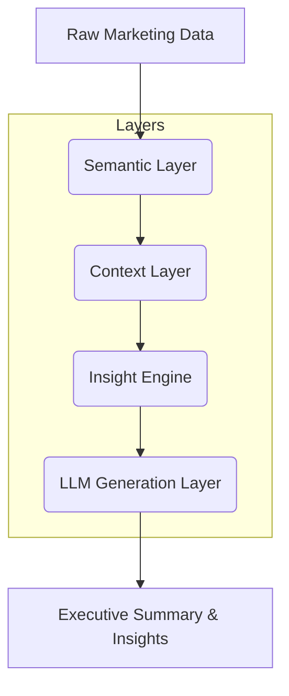

# AI-Powered Marketing Executive Intelligence Engine

Transform your marketing data into actionable, board-ready executive insights with an enterprise-grade, modular AI system.

---

## 🚀 Overview
This platform is a production-ready, extensible AI engine for generating executive marketing summaries, strategic insights, and recommendations. It leverages semantic normalization, business memory, anomaly detection, and LLMs to deliver context-rich, enterprise-grade outputs.

---

## 🏗️ Architecture

The system is built on four robust, decoupled layers:

1. **Semantic Layer**
	- Canonicalizes and normalizes raw marketing metrics
	- Maps aliases and enforces business definitions
	- Ensures consistent analytics across sources
2. **Context Layer**
	- Injects business memory, historical context, and campaign narratives
	- Supports retrieval-augmented generation (RAG) and future vector DBs
	- Enriches prompts with relevant facts and prior results
3. **Insight Engine**
	- Detects anomalies, trend accelerations, and risk patterns
	- Flags high-ROAS campaigns and strategic events
	- Outputs structured, explainable insights for decision-makers
4. **LLM Generation Layer**
	- Modular prompt builder and template system
	- Produces deterministic, board-ready executive summaries
	- Integrates with OpenAI or enterprise LLMs

---

## 🖼️ Architecture Diagram



---

## 🔑 Key Features
- **Enterprise-Ready**: Modular, testable, and configurable via YAML/.env
- **Semantic Normalization**: Canonical metric mapping and validation
- **Contextual Enrichment**: Business memory, RAG, and historical comparison
- **Insight Engine**: Rule-based and ML-ready anomaly/trend detection
- **LLM Integration**: Structured prompt builder, deterministic templates, OpenAI-ready
- **Export & UI**: Streamlit dashboard, PDF/text export, and more

---

## 📦 Project Structure
- `semantic_layer/`: Metric schema, ontology, normalization
- `context_layer/`: Business memory, retrieval, context builder
- `genai/`: Prompt builder, templates, insight engine, LLM integration
- `data_models/`, `data_ingestion/`: Data classes and loaders
- `app.py`: Streamlit UI (reference implementation)
- `config.py`: Centralized, enterprise configuration

---

## 🛠️ Getting Started
1. Clone the repo and install dependencies:
	```bash
	git clone <repo-url>
	cd <project-folder>
	pip install -r requirements.txt
	```
2. Configure your environment:
	- Set API keys and config in `.env` or `config.yaml`
3. Launch the UI:
	```bash
	streamlit run app.py
	```

---

## 📈 Extensibility
- Swap in Pinecone, Weaviate, or FAISS for vector search
- Integrate with enterprise LLMs or custom prompt templates
- Extend the insight engine with ML models or custom rules

---

## 👥 Authors & License
- Built by Shrikant Lambe
- MIT License
